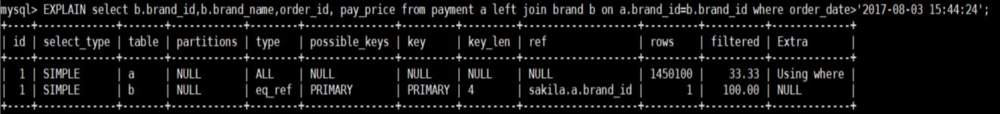
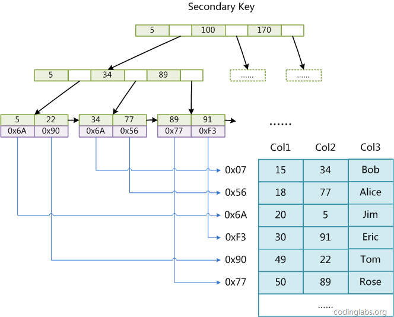

http://blog.codinglabs.org/articles/theory-of-mysql-index.html

#### 存储引擎

######      InnoDB引擎

​		基于聚簇索引建立,现在的默认引擎

######  	MyISAM引擎

​		5.1版本之前的默认存储引擎

​         特性: 全文检索,压缩,空间函数 ; 不支持事务和行级锁,崩溃后无法安全恢复

###### 	Memory引擎

​		数据保存在内存中,无需I/O,重启时保留结构,数据丢失

#### 慢日志查询

#### EXPLAIN

​		

​		table：对应的表 

​		type：连接类型（system、const、eq_ref、ref、range、index、ALL） 

​				ALL：全表扫描 

​				index：按索引顺序进行全表扫描 

​				range：按索引范围查找 

​				ref：是一种索引访问，返回所有匹配某个值的行 

​				eq_ref：是一种索引访问，MySQL知道最多只返回一条符合条件的记录 

​				const\system：使用常量对主键索引或唯一索引扫描

​		possible_keys：可能使用的索引 

​		key：实际使用的索引 

​		key_len：使用索引长度 

​		rows：预计扫描行数 

​		Extra：解析查询的额外信息（using index、using where、using temporary、using filesort）

​				Using index：列数据仅仅使用了索引中的信息而没有读取实际的表 

​				Using where：MySQL服务器将在存储引擎检索行后，通过Where子句条件进行过滤 

​				Using temporary：MYSQL需要创建一个临时表来存储结果，用于排序 

​				Using filesort：MySQL将对结果进行外部排序

#### 索引

###### MYISAM引擎非聚簇索引

###### InnoDB引擎聚簇索引

###### InnoDB主键

​	如果正在使用InnoDB表，并且没有什么数据需要聚集，那么可以定义一个代理键作为主键，这种主 

键的数据应该和应用无关，最简单的方法是使用AUTO_INCREMENT自增列。这样可以保证数据行是按顺 

序写入，对于根据主键做关联操作的性能也会更好。 

​	主键的值是顺序的，所以InnoDB把每一条记录都存储在上一条记录的后面。当达到页的**最大填充因** 

**子**(15/16)时，下一条记录就会写入新的页中。一旦数据按照这种顺序的方式加载，主键页就会近似于被顺序的记 

录填满，这也正是所期望的结果。 

​	非递增的主键插入数据会导致页分裂。因为新的记录可能插入到之前记录的中间，导致需要强制移动 

之前的记录，如果新纪录要插入的位置所在的页被写满且已经被刷新到磁盘上，会导致重新从磁盘读取该 

页。InnoDB引擎表中非递增主键的一些**缺点**： 

​		可能导致大量的随机I/O 

​		频繁的页分裂操作 

​		不规则填充导致产生数据碎片

###### 高效索引策略

​	*组合索引：在多个列上建立独立的单列索引，大部分情况下并不能提高MySQL的查询性能。MySQL允许 

​	将多个单独列合并创建一个组合索引。 

​	*独立的列：如果查询中的列不是独立的，则MySQL就不会使用索引。 

​	*前缀索引和索引选择性：有时候需要检索很长的字符列，这会让索引变得很大且慢。通常可以索引开始的 

​	部分字符，这样可以大大节约索引空间，从而提高索引效率，但这样也会降低索引的选择性（不重复的索 

​	引值与数据表的记录总数的比值）。但是MySQL无法使用前缀索引做ORDER BY和GROUP BY，也无法使 

​	用前缀索引做覆盖扫描。 

​	*选择合适的索引列顺序：正确的顺序依赖于使用该索引的查询，并且同时需要考虑如何更好地满足排序和 

​	分组的需要。 

​	覆盖索引：如果一个索引包含（或者说覆盖）所有需要查询的字段值，我们就称之为“覆盖索引”。 

​	索引排序：MySQL可以使用同一个索引既满足排序，又用于查找行。 

​	压缩索引：MyISAM使用前缀压缩来减少索引的大小，从而让更多的索引可以放入内存中，这在某些情况 

​	下能极大地提高性能。 

​	排除冗余和重复索引：MySQL允许在相同列上创建多个索引，无论是有意还是无意的。MySQL需要单独 

​	维护重复的索引，并且优化器在优化查询的时候也需要逐个进行考虑，这会影响性能。

###### 索引选择的3个原则

​	① 单行访问是很慢的。特别是在机械硬盘中。如果服务器从存储中读取一个数据块只是为了获取其中一 

​	行，那么就浪费了很多工作。最好读取的块中能包含尽可能多所需要的行。使用索引可以创建位置引 

​	用以提高效率。 

​	② 按顺序访问范围数据是很快的。这有两个原因：第一，顺序I/O不需要多次磁盘寻道，所以比随机I/O 

​	要快很多（特别是对机械硬盘）。第二，如果服务器能够按需要顺序读取数据，那么就不再需要额外 

​	的排序操作，并且GROUP BY查询也无须再做排序和将行按组进行聚合计算了。 

​	③ 索引覆盖查询是很快的。如果一个索引包含了查询需要的所有列，那么存储引擎就不需要再回表查找 

​	行。这避免了大量的单行访问，而上面的第一点已经写明单行访问是很慢的。

###### 建议

​	频繁更新的字段不适合建立索引 

​	参与列计算的列不适合建索引 

​	数据重复且唯一性太差的字段不适合建立索引，例如：性别，真假值 

​	表数据可以确定比较少的不需要建索引 

​	where条件中用不到的字段不适合建立索引

