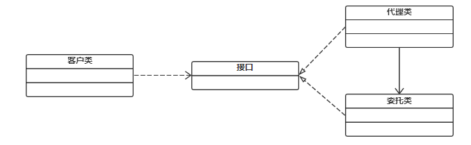

代理模式
==============
代理模式定义
--------------
代理模式给某一个对象提供一个代理对象，并由代理对象控制对原对象的引用。通俗的来讲代理模式就是我们生活中常见的中介。

类图
-----


使用场景
-----
######      中介隔离作用
在某些情况下，一个客户类不想或者不能直接引用一个委托对象，而代理类对象可以在客户类和委托对象之间起到中介的作用，其特征是代理类和委托类实现相同的接口。

######      开闭原则、增加功能
代理类除了是客户类和委托类的中介之外，我们还可以通过给代理类增加额外的功能来扩展委托类的功能，这样做我们只需要修改代理类而不需要再修改委托类，符合代码设计的开闭原则。代理类主要负责为委托类预处理消息、过滤消息、把消息转发给委托类，以及事后对返回结果的处理等。代理类本身并不真正实现服务，而是同过调用委托类的相关方法，来提供特定的服务。真正的业务功能还是由委托类来实现，但是可以在业务功能执行的前后加入一些公共的服务。例如我们想给项目加入缓存、日志这些功能，我们就可以使用代理类来完成，而没必要打开已经封装好的委托类。

代理模式分类
----------
#### 静态代理
###### 静态服务类接口
声明一个买房子的接口，表明我要买房子的决心。
```java
package main.java.proxy;

public interface BuyHouse {
    void buyHosue();
}
```
###### 实现服务类接口
实现一个单纯交钱买房的对象，突出一个人傻钱多！
```java
import main.java.proxy.BuyHouse;

public class BuyHouseImpl implements BuyHouse {

    @Override
    public void buyHosue() {
        System.out.println("我要买房，给钱！搞定！");
    }
}
```
###### 创建代理类
通过构造注入的方式，将买房对象注入中间商代理中。接下来将不关心买房的其他细节（如资质审核、验房、装修），都交给代理商去完成，自己需要做的就是交钱买房。
```java
package main.java.proxy.impl;

import main.java.proxy.BuyHouse;

public class BuyHouseProxy implements BuyHouse {

    private BuyHouse buyHouse;

    public BuyHouseProxy(BuyHouse buyHouse) {
        this.buyHouse = buyHouse;
    }

    @Override
    public void buyHosue() {
        System.out.println("买房前准备");
        buyHouse.buyHosue();
        System.out.println("买房后验房！装修！");

    }
}
```

###### 测试类
下面我们开始来买房。
```java
import main.java.proxy.impl.BuyHouseImpl;
import main.java.proxy.impl.BuyHouseProxy;


public class ProxyTest {
    public static void main(String[] args) {
        BuyHouse buyHouse = new BuyHouseImpl();
        buyHouse.buyHosue();
        BuyHouseProxy buyHouseProxy = new BuyHouseProxy(buyHouse);
        buyHouseProxy.buyHosue();
    }
}
```
##### 优点
可以做到在符合开闭原则的情况下对目标对象进行功能扩展。

##### 缺点
我们得为每一个服务都得创建代理类，工作量太大，不易管理。同时接口一旦发生改变，代理类也得相应修改。

#### 动态态代理

###### 比较复杂！下回分解