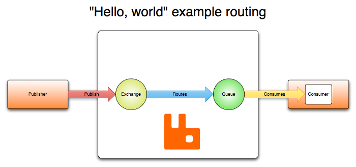
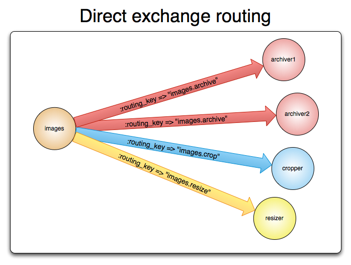
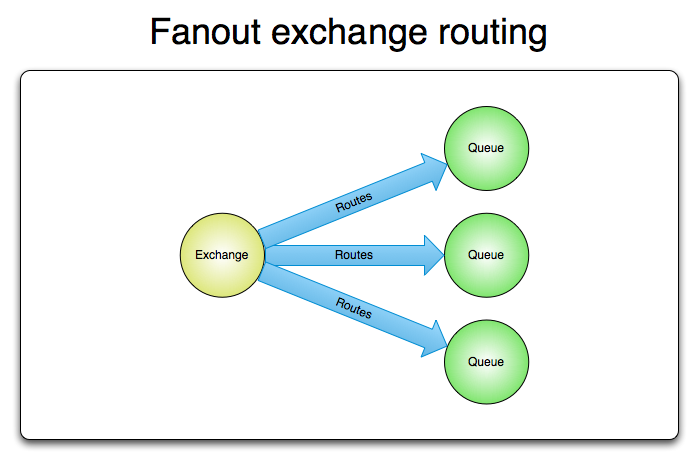

# AMQP 简介（上）

RabbitMQ 是 AMQP 0-9-1 协议的一个典型实现，如果想熟悉 RabbitMQ，AMQP 是一定要了解的。 

AMQP 0-9-1 全称是 Advanced Message Queuing Protocol。 

AMQP 的作用可以简单描述为：

AMQP 有三个主要组件，分别是：

* Exchange  接收消息的组件，publisher 生产的消息会直接发送到 Exchange
* Queue  字面意思上的队列，用于存储消息
* Binding  消息从 Exchange 投递到指定 Queue 的规则

消息从 Exchange 投递到指定 Queue 的路由算法依赖于：Exchange 类型，Binding 

为应对网络问题和应用报错导致的消息无法正确处理的情况，AMQP 引入了 ack 机制（*message acknowledgements*）：消息投递给 Consumer 之后，Consumer 会通知 broker，通知方式有自动通知和手动触发两种，由开发者自由选择。在 ack 机制启用的情况下，brocker 之后在收到通知后才会删除该条消息。 

## Exchange

exchange 用于接收消息 

除去必须指定的类型，在声明一个 Exchange 时还需要一些其他参数，最常用的是以下 4 个：

* Name
* Durability (broker 重启 exchange 仍然存活)
* Auto-delete (没有 queue 绑定到该 exchange 时自动删除)
* Arguments (可选，用于指定插件特性和 broker 特定功能)

如果一条消息无法从 Exchange 路由到 Queue，根据参数不同有以下几种处理方式：

* 消息返回给 Publisher
* 丢弃该消息
* 如果 broker 实现了扩展，可以放入死信队列（*dead letter queue*）

### Exchange 类型

#### Default exchange

default exchange 是一种 direct exchange。 

最重要的特性：queue 创建时会自动绑定，routing key 就是队列名（*queue name*） 

消息发送给 default exchange 时，会通过队列名直接发送给对应的 queue，看起来 exchange 就是透明的，在小型应用中非常有用。 

#### Direct exchange

默认名称（*Default pre-declared names*，不知道咋翻，先这么叫吧，下同）是 "" 或者 amq.direct。 

通过消息的 routing key 决定如何投递。工作方式如下：

* queue 会绑定到一个 routing key 为 K 的 exchange
* 携带 routing key 为 R 的消息到达 direct exchange，如果 R == K，则投递消息到绑定的 queue

#### Fanout exchange

默认名称是 amq.fanout  

不通过 routing key 进行路由。当 fanout exchange 收到消息后，会将消息（的备份）广播给所有已绑定的 queue。

#### Topic exchange

默认名称是 amq.topic  

topic exchange 依据消息的 routing key 和 binding，将消息发送给 1 个或多个 queue。多用于实现各种 发布/订阅 模式（及其变体）

#### Headers exchange

默认名称是 amq.match (RabbitMQ 中称为 amq.headers)  

被设计用来根据 消息体Header 中的多个属性进行路由，路由过程中，routing key 不发挥任何作用。

## Queue

用于存储消息，和 exchange 有类似的参数，其他的重要参数如下：

* Name

* Durable （broker 重启后 queue 仍然存活）

* Exclusive （仅被一个 connection 使用，connection 关闭后 queue 自动删除）

* Auto-delete（当没有消费者订阅该队列时自动删除）

* Arguments （可选，用于指定插件特性和 broker 特定功能）

queue 必须声明之后才可以使用。声明会自动创建 queue，如果队列已创建，重复声明没有什么影响，前提是声明参数也一致，如果不一致就会报错。

### Queue 名称

最长为 255 个字节长度的 UTF-8 字符。声明queue 时如果不指定队列名，broker 会自动生成一个唯一名称。 

"amq." 前缀的队列名是 broker 内部保留名，不能使用，会报错。

## Consumer

消费方式有两种：

* push 方式，也是推荐方式
* pull 方式，有严重的性能问题，不推荐使用

Consumer 由 string 类型的 consumer tag 标识

## Connection

AMQP 0-9-1 的 connection 就是 TCP 长连接 

当 application 不需要再连接到 server 时，最好手动关闭一波，而不是突然把 TCP 连接断开

## Channel

application 和 server 所有的连接都独占一个 connection（TCP 长连接），是非常不妥的：它消耗资源啊，并且可能还得设置防火墙 

channel 应运而生，可以理解为：共享同一个 TCP 长连接的轻量级 connection 

客户端的每个协议操作都发生在 channel 上，channel 逻辑上是各自独立的，由 integer 类型的 channel id 标识 

channel 存在于 connection 上下文中，一旦 connection 断开，它上边的 channel 也一块儿玩完

## 参考文档

[RabbitMQ 官网](https://www.rabbitmq.com/tutorials/amqp-concepts.html)